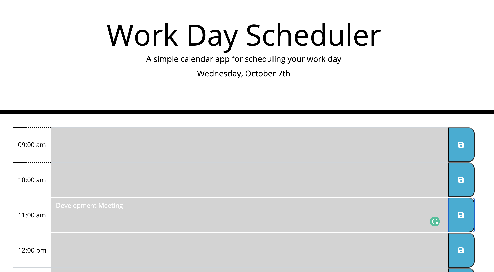

# Work Day Scheduler

## Description

This application allows a user to enter text in the time block elements and save their data. The time blocks are colored based on the time of day.

Grey - Hour has passed
Red - Current hour
Green - Future hour

This application is perfect for an office or company with a 9am - 5pm schedule.

Final Website Link: https://shelbyandersen.github.io/work-day-scheduler/

## Overview

When you open up the application you will see the current day displayed at the top of the page.

There are time blocks between the hours of 9am and 5pm. Each time block has a text area where you are able to type. There is a save button to the right of the time block. When the save button is clicked, the information is stored and will show if the page is refreshed.

## Installation

The code for the Work Day Scheduler can be found on github using the following link:
https://github.com/shelbyandersen/work-day-scheduler

## Usage

The Workday Scheduler has an HTML, CSS, and JavaScript file. The code utilizes the moment.js library to display the current day, and to color code the hours based on the time of day. the jQuery library was also used for this application.

Code will need to be taken from the repo on github and changes can be made:

https://github.com/shelbyandersen/work-day-scheduler

## Credits

The initial design of this application was provided by Trilogy Educational Services.

The application was completed by Shelby Andersen

## License

At this time there is no license associated with this project.

---

© 2020 Shelby Andersen in Collaboration with Georgia Tech Coding Boot Camp. All Rights Reserved.
